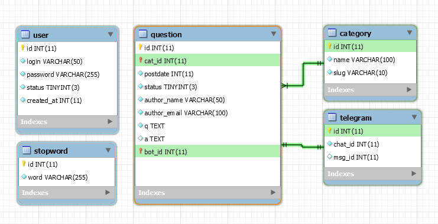

Дипломный проект
===============================

@author Aleksandr Kurov

# Установка
Для установки нужно скопировать все содержимое в выбранный каталог сервера.

Домашняя директория:
```
значение $path_root из файла конфигурации
```

Пользователь по умолчанию:
```
admin:admin
```

## База Данных
Параметры подключения к БД задаются в файле:
```
conf.php
```

Дамп базы данных:
```
faq.sql
```

Схема базы данных:
```
schema.png
```




# Дополнительный функционал

## Логгер

Класс:
```php
class App\Extensions\Loggers\AdminLogger
```

Лог-файл:
```
/logs/admin.log
```

## Блокировка по ключевым словам

Класс:
```php
class App\Extensions\StopWords\StopWord
class App\Extensions\StopWords\StopWordModel
```

## Telegram Bot
Класс:
```php
class App\Extensions\Telegram\TelegramBot
class App\Extensions\Telegram\TelegramModel
```

Бот:
```
http://telegram.me/SimpleQaBot
```